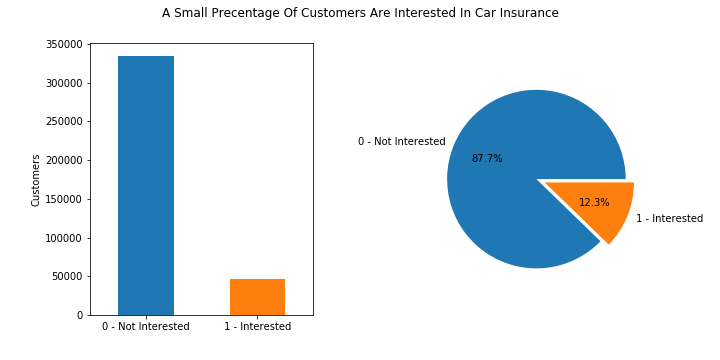
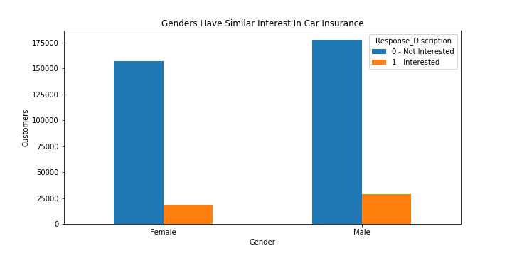
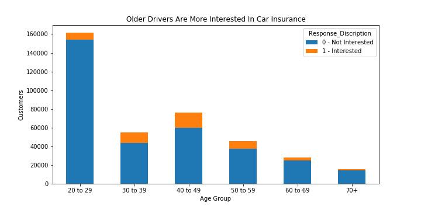
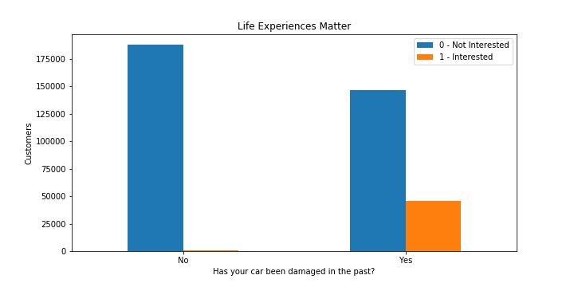
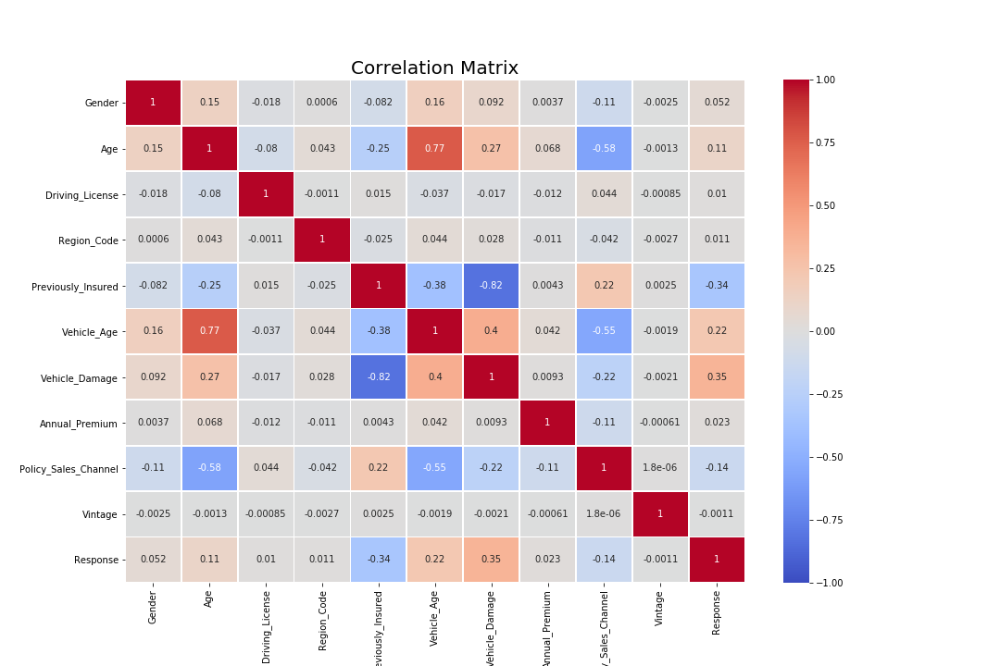

# Predicting Potential Cross-Sale Opportunities with Machine Learning
Predicting if health insurance customers will be interested in purchasing an insurer's new car insurance product using Machine Learning.

## Project Links
* [Model Building Notebook](ml_model_build.ipynb)
* [Vizualization Notebook](eda_viz.ipynb)
* [Heroku App](https://cross-sale-predictions.herokuapp.com/)

## Data Source:
* Kaggle [Health Insurance Cross Sell Prediction Data Set](https://www.kaggle.com/anmolkumar/health-insurance-cross-sell-prediction?select=train.csv). 
    * The Kaggle train.csv file was used to build and train our model, and is saved in our Resources folder as [customer_data.csv](resources/customer_data.csv).
    * The Kaggle test.csv data was used to externally test our model, and may be found [here](resources/test.csv).
    
The data used to build our selected Machine Learning model contains contains 11 customer attributes found below.

## Tools
### Back-end
* Python 
* Sklearn
* Joblib
* Pandas
* Matplotlib
* Seaborn
* Numpy
* Sqlalchemy
* Sqlite3
* Flask

### Front-end
* HTML
* Bootstrap
* CSS
* Javascript

### Deployment
* Heroku

## Data Exploration
It is a large dataset with over 380,000 records, and only 12% of customers conveying interest in purchasing car insurance. Customer responses and specific attributes were compared.
To view all visualizations created, please refer to the [Vizualization Notebook](eda_viz.ipynb).

Correlation analysis was also conducted, which allowed for the identification of the age and vehicle age relationship.

## Model Selection
This task was identified as a classification problem due to the mutltiple customer attribute combinations.
By using K-Nearest Neighbors (KNN), data points can be classified based on their proximity and association to other available data.

## Building the Model
### Data Preprocessing
Categorical data was converted into numeric values in order for the information to be applied to our model.
The ID column that was initially provided with the dataset was also excluded from our model as it did not add value to the generation of predictions.

### Model Training
Using Sklearn's train-test split function, training and testing data was extracted from the [customer_data.csv](resources/customer_data.csv) in order to train the KNN model and evaluate its accuracy.
Before training the model, a series of k-values were populated and plotted in order to identify the point of convergence/stability which allowed the selection of k-value 17 (as this k-value captured some uncertainty prior to the identified point of convergence). 

### Model Evaluation
Out of the 95278 records in the test data supplied from the train-test split, the KNN model correctly predicted 83425 customer outcomes and reached an accuracy level of 0.876.
The model returned 28 correct positive responses. 

### Model Results
When the data was run against the external [testing dataset](resources/test.csv), no customers were identified as interested in purchasing car insurance. This is likely due to the machine only being supplied a small percentage of interested individuals, which reduced its output.

These outcomes may be found on our published [app](https://cross-sale-predictions.herokuapp.com/).

## Flask App Routes
* "/" - Home Page
* "/api/v1.0/testing_data" - Returns all testing data that has been formatted to be applied on the KNN model.
* "/api/v1.0/original_testing_data" - Returns all testing data in a user readable format.
* "/api/v1.0/< customer_id >" - Returns user readable test data for a specific customer ID.
* "/api/v1.0/prediction/< customer_id >" - Returns a purchase prediction for a specific customer ID.
* "/api/v1.0/user_prediction/< multi value entry >" - Returns a prediction for inputted customer data.

## Flask App Infastructure

## Next Steps
* Apply oversampling onto the dataset to increase the number of interested customers in order to address the issue of few positive responses in original dataset.
* Experiment with model results to achieve a 90-95% accuracy level. 
* Experiment with using less customer attributes to identify interested and non-interested customers.
* Apply a different method to load large datasets into web apps.
* Make available a form entry method for users to select and submi different attributes to predict cross sale potential. 

----

